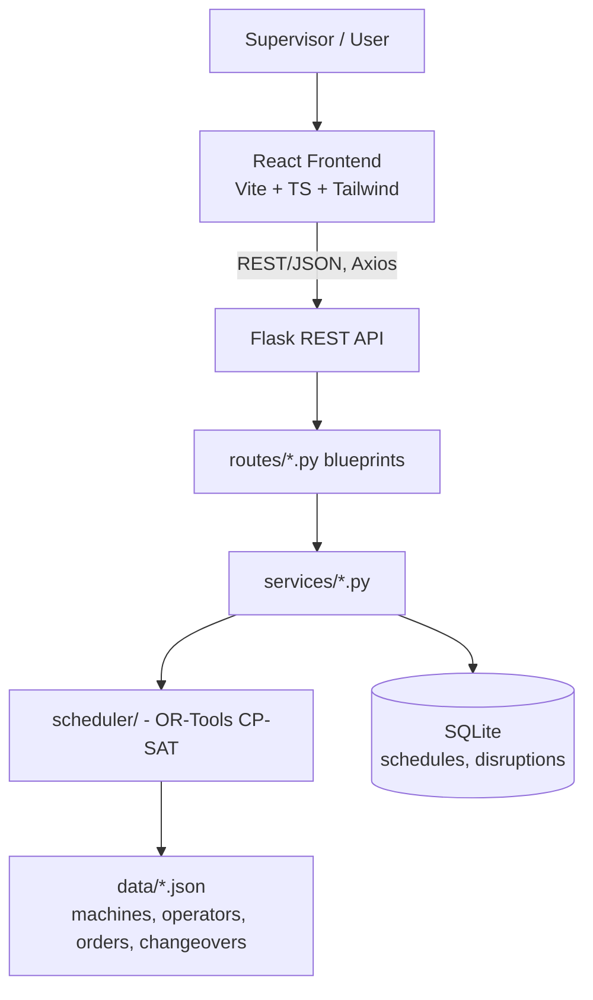
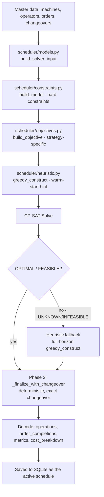
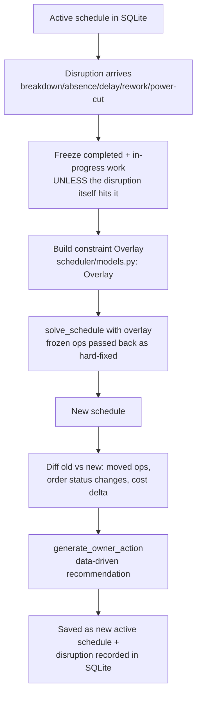
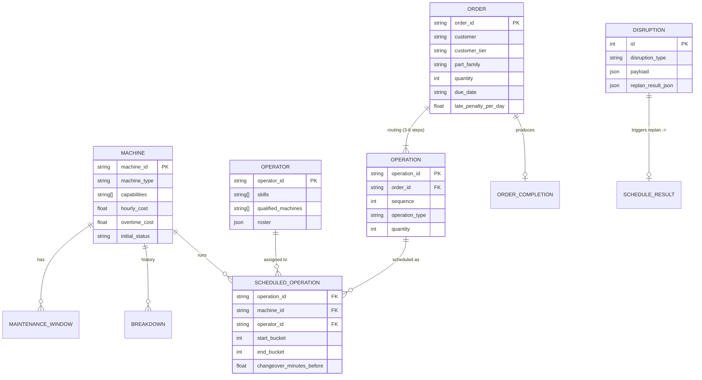
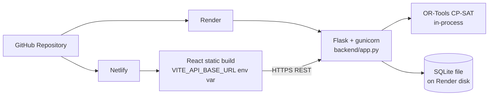
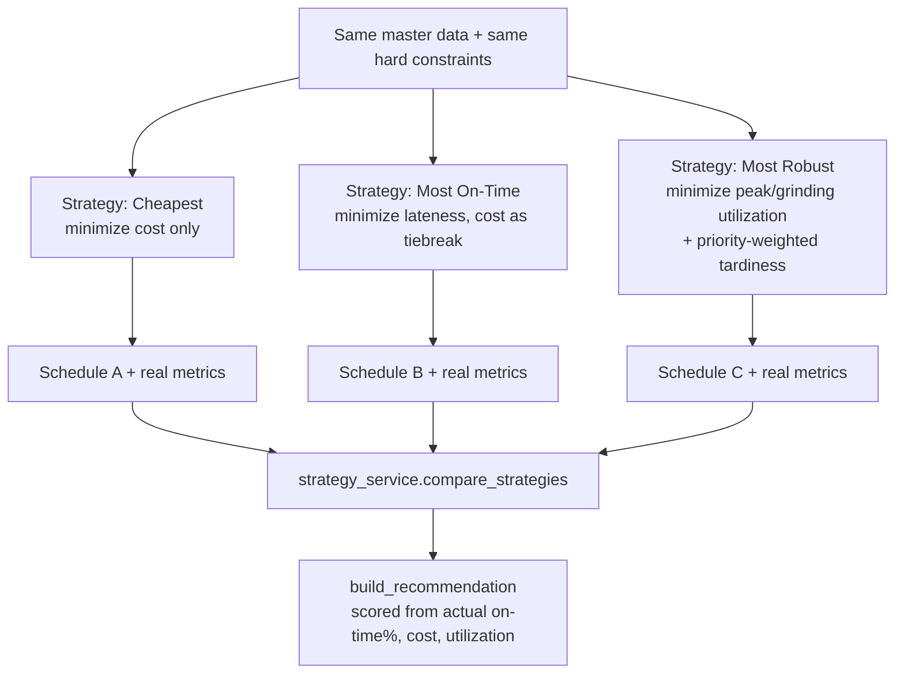

# Architecture Diagrams

## 1. Overall system architecture

## 2. Scheduling flow

## 3. Replanning flow

## 4. Data model / ER diagram

## 5. Deployment architecture

## 6. Three-strategy optimization flow

See [system-design.md](system-design.md) for the component-level
narrative behind each box, and
[scheduling-algorithm.md](scheduling-algorithm.md) /
[disruption-replanning.md](disruption-replanning.md) for the two flows
that matter most.
